<div align="center">

  <!-- Executive Cybernetic Animated Banner -->
  <a href="https://github.com/mysterious03">
    
  </a>

  <!-- High-Impact Typing SVG Banner -->
  <a href="https://git.io/typing-svg">
    
  </a>

  <br /><br />

  <!-- Live Status & Social Badges -->
  <a href="https://github.com/mysterious03">
    
  </a>
  <a href="https://komarev.com/ghpvc/?username=mysterious03&color=00ff41&style=for-the-badge&label=PROFILE+VIEWS">
    
  </a>
  <a href="https://github.com/mysterious03" target="_blank">
    
  </a>
  <a href="https://linkedin.com/in/mysterious03" target="_blank">
    
  </a>
  <a href="mailto:contact@suriya.dev" target="_blank">
    
  </a>

</div>

---

### ⚡ Executive Profile & Engineering Philosophy

Hi there! I'm **Suriya Prakash**, an engineer operating at the convergence of **On-Device Artificial Intelligence**, **Algorithmic Data Engineering**, and **Embedded IoT Hardware**.

My core focus centers on building **frugal, zero-cloud autonomous systems** and low-latency physical computing pipelines. Whether it's training neural models to interpret multi-modal sensory inputs, inventing custom spatial data structures that eliminate memory overhead, or programming microcontrollers to capture telemetry at the hardware edge, I build systems designed for autonomy, resilience, and real-world utility.

```ascii
┌─────────────────────────────────────────────────────────────────────────────┐
│ 🧠 AI/ML & VLMs         │ 🔌 Embedded Systems & IoT │ 📐 Spatial Algorithms │
│ On-Device Vision Agents │ ESP32, C++ Firmware & I/O │ Matrid Dynamic Struct │
└─────────────────────────────────────────────────────────────────────────────┘
```

- 🔭 **Current Active Research**: On-Device Visual Perception Agents (**PIXEL ODVPA**) for zero-cloud browser automation and spatial task execution.
- 🧩 **Algorithmic Innovation**: Developing **Matrid**, an expanding 2D quad-directional dynamic data structure tailored for sparse matrix systems.
- ⚡ **Hardware-to-Cloud Bridge**: Designing sensor-to-model data pipelines streaming real-time telemetry from microcontrollers (ESP32/C++) into neural inference engines.
- 💬 **Ask Me About**: Edge AI inference, Computer Vision & VLMs, Embedded C++, Custom Data Structures, and Modern Fullstack React/TypeScript architectures.

---

### 🔬 Core Engineering Domains & What I Do

#### 1. 🧠 Autonomous AI, Computer Vision & VLMs
- **On-Device Vision Agents**: Engineering local, privacy-first vision-language models that process accessibility trees (AXTree) and graphical UI elements for autonomous browser automation.
- **Deep Learning Pipelines**: Architecting convolutional neural networks and transformer backbones with PyTorch, TensorFlow, and OpenCV for emotion classification and visual telemetry.
- **Model Optimization**: Quantizing neural weights and designing lightweight edge pipelines for low-power computing hardware.

#### 2. 🔌 Embedded Systems, Firmware & IoT Telemetry
- **Microcontroller Firmware**: Writing deterministic, non-blocking C++ for ESP32, Arduino, and ARM platforms.
- **Sensor Fusion & Telemetry**: Integrating IMUs, environmental sensors, optical detectors, and industrial actuators via I2C, SPI, and UART interfaces.
- **Edge-to-Cloud Networking**: Transmitting encrypted telemetry packets across MQTT, HTTP, WebSockets, and Bluetooth Low Energy (BLE).

#### 3. 📐 Systems Architecture & Data Structures
- **Spatial Data Structures**: Designing specialized memory layouts like **Matrid** (a quad-directional dynamic matrix that expands infinitely without shifting existing records).
- **Spatial Simulations**: Building cellular automata simulations and grid computing engines (**LifeGrid Sim**) in TypeScript.
- **Performance Profiling**: Profiling memory allocation, cache locality, and latency bottlenecks across both high-level runtimes and low-level C++.

#### 4. 🎨 Modern Web Architectures & Interactive Dashboards
- **Reactive Interfaces**: Crafting responsive, fluid web applications using React, Next.js, and TypeScript.
- **Real-Time Data Streaming**: Visualizing live hardware telemetry feeds and AI inference states on high-frequency UI dashboards.

---

### 🚀 Featured Innovations & Repositories

| Project | Description | Primary Stack | Architecture & Scope |
| :--- | :--- | :--- | :--- |
| **⚡ [PIXEL (ODVPA)](https://github.com/mysterious03/PIXEL)** | **On-Device Visual Perception Agent** for autonomous browser automation | `JavaScript` `AXTree` `VLMs` | Frugal, privacy-first zero-cloud perception engine built for **SIH 2026 PS 26171 / ISRO**. |
| **🧩 [Matrid](https://github.com/mysterious03/matrid)** | **Quad-Directional Dynamic 2D Data Structure** for sparse and spatial systems | `JavaScript` `Data Structures` | Expands in 4 directions without data reallocation, eliminating copy overhead for spatial matrices. |
| **🧠 [Emotion Detection AI](https://github.com/mysterious03/AI-Powered-Emotion-Detection-from-Text)** | **Neural NLP Classifier** for granular emotional analytics from textual datasets | `Python` `PyTorch` `Pandas` | Preprocessing pipelines, tokenization, and deep learning classification model. |
| **🧬 [LifeGrid Sim](https://github.com/mysterious03/lifegrid-sim)** | **Spatial Simulation Engine** computing emergent 2D cellular automata dynamics | `TypeScript` `Canvas` | High-frequency grid computation with interactive parameter tuning. |
| **🔌 [Embedded IoT Telemetry](https://github.com/mysterious03/project-k)** | **Hardware Sensor Data Acquisition** and controller firmware | `C++` `ESP32` `Sensors` | Real-time sensor polling, calibration algorithms, and serial packet transmission. |
| **🌐 [DOMPULSE](https://github.com/mysterious03/DOMPULSE)** | **DOM Mutation & Observation Agent** for reactive visual element tracking | `TypeScript` `Web APIs` | High-speed observer framework monitoring structural DOM shifts. |

---

### 💻 System Terminal Overview

```bash
root@suriyaprakash:~$ suriya --profile --verbose

[SYSTEM INFO]
  Name          : Suriya Prakash
  Role          : AI/ML Researcher & Embedded Systems Engineer
  Location      : India (IST / UTC+5:30)
  Focus Areas   : On-Device Vision (ODVPA), Spatial Data Structures, IoT Firmware
  Primary Stack : Python • C++ • PyTorch • ESP32 • TypeScript • React

[CORE CAPABILITIES]
  » Edge AI        : Multi-modal VLMs, Computer Vision, On-Device Agents
  » Firmware       : Bare-metal C++, FreeRTOS, Sensor Fusion, Serial I/O
  » Systems        : Matrid (Quad-Directional 2D Memory Array), Spatial Graphs
  » Web Systems    : High-throughput dashboards, Real-time WebSockets, Next.js

[CURRENT STATUS]
  ● ODVPA Engine   : ACTIVE // Optimizing AXTree token parsing
  ● Hardware Edge  : ACTIVE // ESP32 Telemetry & Sensor Nodes
  ● Open for Collab: Research in On-Device AI, Robotics & Autonomous Agents
```

---

### 🛠️ Technical Arsenal & Ecosystem

#### 🤖 **Artificial Intelligence & Data Science**


#### 🔌 **Embedded Systems, IoT & Hardware**


#### 🎨 **Modern Frontend & Fullstack Systems**


#### ⚙️ **Tools, Platforms & Workflows**


---

### 📊 GitHub Analytics & Activity

<div align="center">

  
  

  <br/><br/>

  

</div>

---

### 💬 Connect & Collaborate

I am always interested in discussing **On-Device AI research**, **autonomous vision agents**, **novel algorithmic data structures**, or **embedded hardware architectures**.

- 💼 **LinkedIn**: [Suriya Prakash](https://linkedin.com/in/mysterious03)
- 🐙 **GitHub**: [@mysterious03](https://github.com/mysterious03)
- 📬 **Email**: [contact@suriya.dev](mailto:contact@suriya.dev)

<br/>

<div align="center">

  

  <br/><br/>

  ✨ *Engineered with passion by Suriya Prakash • Bridging Physical Sensors, Edge Intelligence & Modern Web* ✨

</div>
